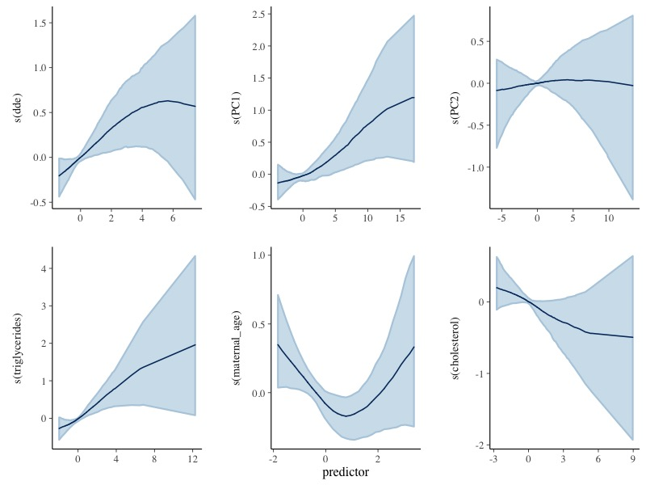
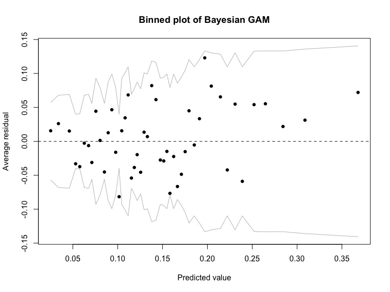

\fontsize{10}{12}
\selectfont

### Abstract

This report evaluates association between exposures Dichlorodiphenyldichloroethylene (DDE) $\&$ Polychlorinated Biphenyls (PCBs) and the risk of preterm birth, using a subset of data from the National Collaborative Perinatal Project(CPP). We adopted the Generalized Additive Model (GAM) as well as its Bayesian counterpart for analysis. Our approach successfully captured the nonlinearity between interested variables and risk of premature delivery, and it also aligns with known conclusions in epidemiology. Our results demonstrate that exposure to higher concentrations of DDE and PCBs are associated higher risk of preterm birth.

## 1. Introduction

The dataset taken from CPP includes 2380 samples of women and their children which was studied by Longnecker et al. (2001). It is of interest to study how chemical exposures relate to preganancy since abnormalities in pregnancy such as preterm birth might cause unfavorable developmental outcomes in children. Preterm birth is deliveries occuring earlier than 37 weeks of gestational age. DDE and PCBs are of primary interest among all exposures, both of which are breakdown products in the body of chemicals. These chemicals build up fatty deposits and exist universally in our body, potentially impacting our health. The dataset also contains other possible confounding variables such as cholesterol, triglyceridesage, maternal age, race and smoking status. The goal of our analysis is to assess how DDE and PCBs relate the risk of preterm birth, controlling for counfounding variables.

Our findings demonstrate that there is positive association between two interested exposures and the risk of preterm birth. Higher concentrations of DDE and PCBs are related to higher risk of premature delivery. Although various PCBs show diffrent significance in the relationship, generally they all contribute to higher risk. Some noticable PCBs are pcb_074, pcb_105, pcb_118, pcb_153 and pcb_170. Another finding of our analysis is that when concentration of these exposures is below a threshold, both exposures have little effect, while they have a constant effect when they are above a higher threshold.

## 2. Materials $\&$ Methods

After grouping Gestational Age into binary response variable (Preterm Delivery or Non-preterm Delivery), we first applied frequentist approach to fit the data. Since it is common to have non-linear dose-effect relationship, we used Generalized Additive Model (GAM). The regression function is given by:
$$
g(E(Y)) = \beta_0 + \sum{f(X_j)} + \sum{\beta_k \cdot Z_k}
$$
Logit transformation is applied to the binary response variable. Numeric covariates, including DDE, Pricipal Components (PCs) 1 to 4 of PCBs, Maternal Age, triglycerides level and cholesterol level are smoothed to allow for non-linear association. Furthermore, we also adjusted for categorical confounding variables by including them in the model as linear covariates, which includes Smoking Status, Race, Center, etc. 

We conducted model checking on the fitted GAM model and checked the effect plots of DDE and PCs. In order to quantify the association for DDE and PCBs (via pricipal components), we controled for all other covariates and computed the change in probability of preterm delivery at different levels of DDE and PCBs.

However, frequentist approach may overestimate uncertainty and produce a non-significant p-value. In addition, residual plot of previous GAM model indicates that assumptions of frequentist GAM could be unwarranted. To improve performance of our model, we instead use a Bayesian Generalized Additive Model. We add priors on the common regression coefficients and priors on the standard deviations of the smooth terms. We use default settings in $stan_gamm4$ function in R package $rstanarm$, which adopts a weak informative normal prior for all common regression coefficients and standard deviations of the smooth terms.


## 3. Results

### 3.1 Exploratary Data Analysis

#### 3.1.1 Data Pre-processing

On handeling missing data, we removed albumin from our dataset because around 93% of this variable is missing. There is only one observation missing DDE and PCBs, and we removed this observation. We imputed missing data in the covariates using the *MICE* R package. We examined the correlation among explanatory variables and found high correlation between PCBs, as shown in Figure 1A. Such high correlation might distort modeling result, so we made PCBs into Principal Components (PCs) as introduced in Section 2.

#### 3.1.2 Visualizations

After data pre-processing, we examined the distribution of DDE and first principle component of PCB, and found that for both DDE and PCB, the concentration of chemical is generally higher in observations that has preterm delivery, as shown in Figure 1B and Figure 1C. Among the possible covariates, most notably, there is a nonlinear relationship between age of mother and proportion of early delivery, as shown in Figure 1D.

### 3.2 Main Results

Using frequentist GAM, we found that there are slightly positive association between chemical exposures and preterm delivery. Among all covariates, DDE, PC1, As shown in Figure 2 in the appendix, as DDE level increases, the log-odds of preterm delivery increases. And in Figure 3, increasing PC1 is associated with increasing log-odds of preterm delivery. The change in probability of preterm delivery at different levels of DDE and PC1 are summarized in Tables 1 & 2 in the Appendix.

As shown in the tables, higher DDE level is associated with higher probability of preterm delivery. But the rate of increment decreases as DDE level increases, which aligns with our presumption of dose-response effect (the effect may be less significant as chemical level increases). As for PC1, there is also positive association between PC1 and the probability of preterm delivery. As PC1 has positive relationship with PCBs, the PCBs also have positive association with preterm delivery. Hence, we conclude that the chemicals (DDE and PCBs) have positive association with preterm delivery.

Results from our Bayesian Generalized Additive Model align with previous results in frequentist approach. In Figure 1, higher concentration of DDE and PCBs is related to higher risks for pregnant women. In addition, both DDE and the first principle component have significant p-values, indicating the importance of these exposures in the relationship with the response. If we further consier use estimates of Bayesian GAM to check residual assumptions of GAM, Figure 2 verifies the correctness of Bayesian GAM, which outperforms that of frequentist approach. Estimated effects of DDE and PCBs also have narrower credible intervals compared to frequentist ones. Our model capture some flat regions when concentration is relatively low and high. 

Increase of 1 unit in DDE leads to approxiamately an increase of 0.017 in log odds when DDE has the lowest concentration 2.5 ug/dL. And it decrease to 0.015 when DDE reaches the average concentration 30 ug/dL. But when DDE reaches 120 ug/dL, its increase does not impact the log odds of risk (almost constant risk). This flat region result aligns with domain knowledge of epidemiology that chemical effects become stable after reaching a upper bound. We conclude similar results when analyzing the first principle component of PCBs: when PC1 is lower than 0 or higher than 15, Bayesian GAM shows that change in PC1 has almost no effect. But when PC1 is around its mean value 7.5, one unit increase in PC1 results in an increase of 0.1 in log odds. Note that all loadings for the first PC are positive, where pcb_74, pcb_105, pcb_138, etc. have loadings over 0.3. Therefore after transforming back to original scale, flat region still exist for PCBs, and unit increase in one specific PCB can be attained. (e.g. one unit increase in pcb_138 leads to an increase of 0.66 in log odds when pcb_138 is at mean level 0.67 ng/dL)


### 3.3 Sensitivity Analysis

Frequentist GAM and Bayesian GAM give confidence intervals and credible intervals for measuring the effects respectively. Generally speaking, Bayesian GAM has narrower intervals and more significant p-values in anova tests. Both models show one common result that when concentrations of DDE $\&$ PCBs become higher, uncertainty increase greatly. This is partially due to the fact that we have limited data for higher level concentrations.

In addition, how to deal with the collinearity of PCBs and carry out dimensionality reduction has great influence in our approach. Our adopted PCA approach has the best performance compared to simple sum and factor analysis, which either have low sigfinicance for PCBs, or become unwarranted after model check. 


## 4. Discussion

This report has analyzed how DDE and PCBs relate to the risk of premature delivery. After preprocessing data (e.g. impute missing data) and dimensionality reduction (PCA), we build up different models for the data and finally adopt the Generalized Additive Model (GAM) and its Bayesian version. Our approach has advantages that it captures the nonlinearity relationship between exposures and outcomes, and it also accounts for confounding variables. We conclude that higher exposure to DDE and certain PCBs may be associated with higher risk of premature delivery. 

The first possible extension of our approach is to deal with different centers specially. Our model demonstrates that center 15 and center 37 may deviate from others, which genrally collect samples with higher risks. There are other methods which may perform better in handling the covariate centers. One may adopt a Bayesian hierarchical model which specifies different variances between centers. Another more direct extension of our GAM model is to include mixed effect. We may use Generalized Additive Mixed Model (GAMM) to consider random effect of centers and it can also be applied to other categorical variables like smoking status and race.

After we find out that DDE and PCBs are related to higher risk of preterm birth, we can examine the trend of exposures effects more accurately. Specifying a special prior (e.g. guarantee monotonicity) may benefit from narrower credible intervals compared to frequentist approach and naive bayes approach. 

Furthermore, interaction between chemicals also might impact human health outcomes. Collinearity among PCBs indicates the need for a general dimension reduction method or a variable selection approach. Ferrari and Dunson (2019) build up a bayesian factor model designed for interactions. High correlation between exposure levels can be explained in this flexible dimension reduction approach. Another future research direction is to include penalty in GAM for variable selection.


\newpage

## References


\newpage

## Figures and Tables 

```{r message=FALSE, echo=FALSE}
library(cowplot)
library(ggplot2)
library(magick)

p1 <- ggdraw() + draw_image("corrplot.png", scale = 0.9)+
  ggtitle("Figure 1")
p2 <- ggdraw() + draw_image("ddeVSearly.png", scale = 0.9)+
  ggtitle("Figure 2")
p3 <- ggdraw() + draw_image("pcbVSearly.png", scale = 0.9)+
  ggtitle("Figure 3")
p4 <- ggdraw() + draw_image("earlyVSAge.png", scale = 0.9)+
  ggtitle("Figure 4")

pp1 <- plot_grid(p1, p2, p3, p4, labels = "AUTO")
ggdraw(add_sub(pp1, "Figure 1. Plots for exploratory data analysis", vpadding=grid::unit(0, "lines"), y = 2, x = 0.32, hjust = 0, size=8, fontface="bold"))
```

```{r message=FALSE, echo=FALSE}
library(cowplot)
library(ggplot2)

p1 <- ggdraw() + draw_image("GAMPlotdde.png", scale = 0.9)+
  ggtitle("Figure 1")
p2 <- ggdraw() + draw_image("GAMPlotPC1.png", scale = 0.9)+
  ggtitle("Figure 2")

pp1<- plot_grid(p1, p2)
ggdraw(add_sub(pp1, "Figure 2 & 3. Marginal Effect Plot for DDE and PC1", vpadding=grid::unit(0, "lines"), y = 10, x = 0.32, hjust = 0, size=8, fontface="bold"))
```

\begin{table}[ht]
\centering
\begin{tabular}{rrr}
  \hline
 & Scaled DDE & \% Change in Probability \\ 
  \hline
1 & -1.00 & 1.43 \\ 
  2 & 2.00 & 1.23 \\ 
  3 & 4.00 & 0.32 \\ 
   \hline
\end{tabular}
\caption{Change in Probability of Preterm Delivery at Different DDE Levels}
\end{table}

\begin{table}[ht]
\centering
\begin{tabular}{rrr}
  \hline
 & PC1 & \% Change in Probability \\ 
  \hline
1 & -3.00 & 0.35 \\ 
  2 & 3.00 & 0.66 \\ 
  3 & 7.00 & 2.11 \\ 
  4 & 10.00 & 4.88 \\ 
   \hline
\end{tabular}
\caption{Change in Probability of Preterm Delivery at Different PC1 Levels}
\end{table}

```{r, echo=FALSE, fig.cap="Bayesian Generalized Additive Model", out.width = '100%',fig.align = "center"}

```

```{r, echo=FALSE, fig.cap="Bayesian GAM model check", out.width = '100%',fig.align = "center"}

```

